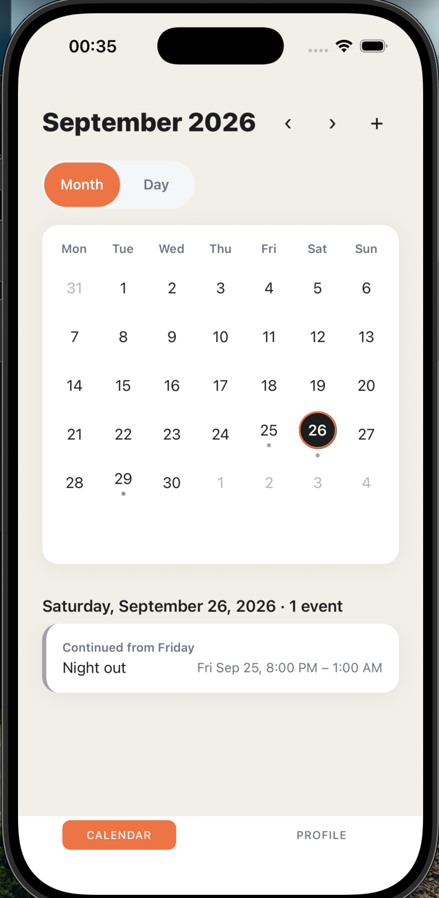
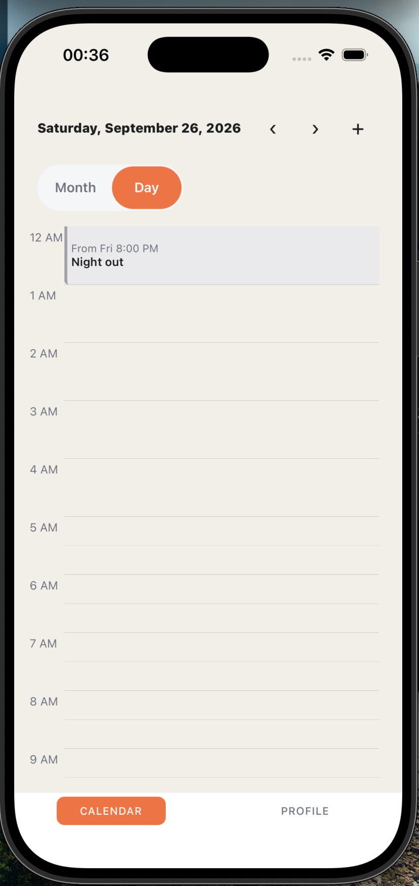
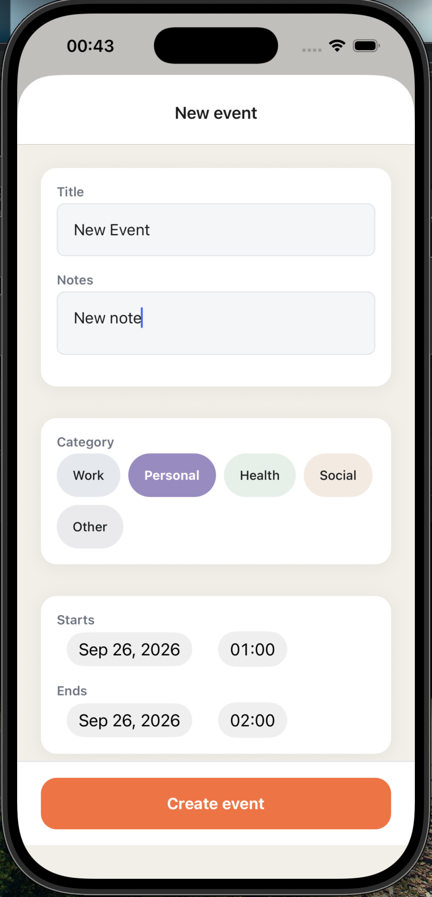
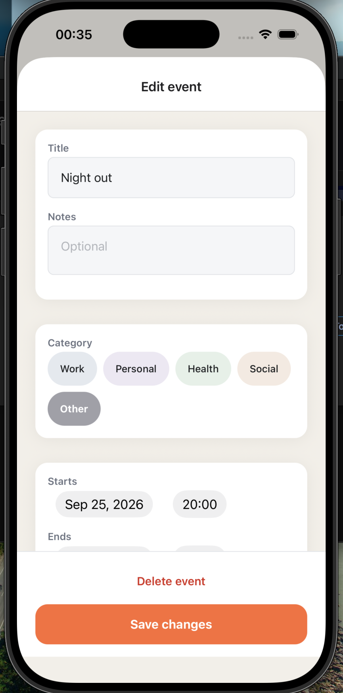
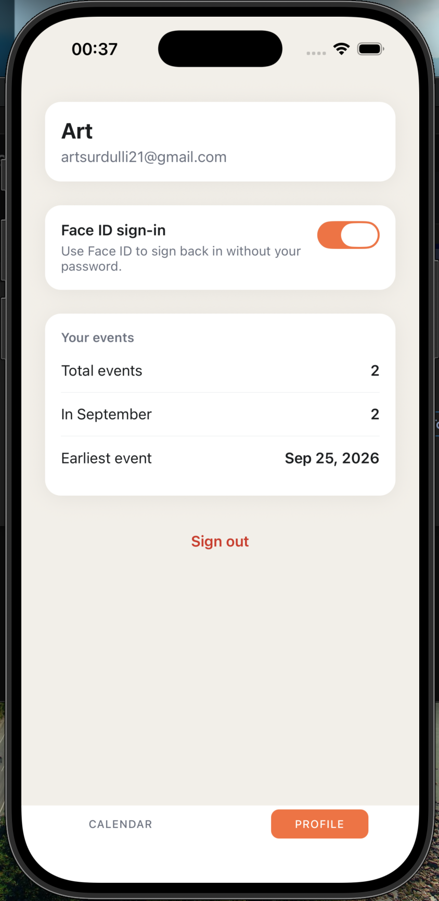
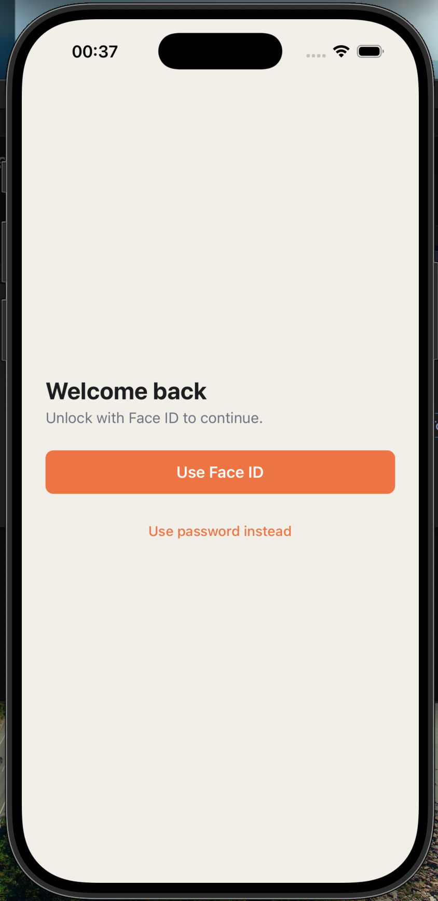
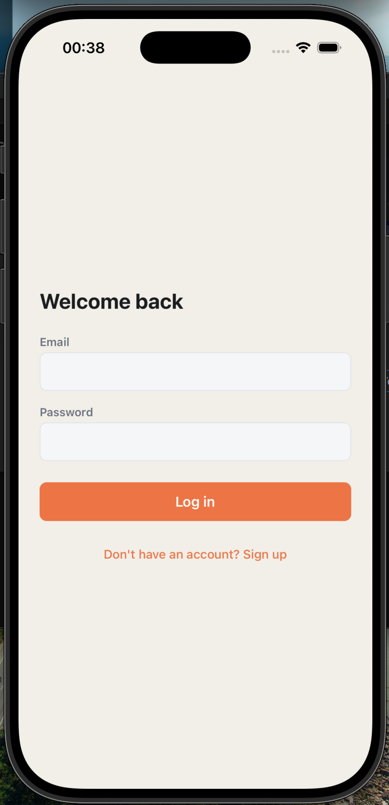
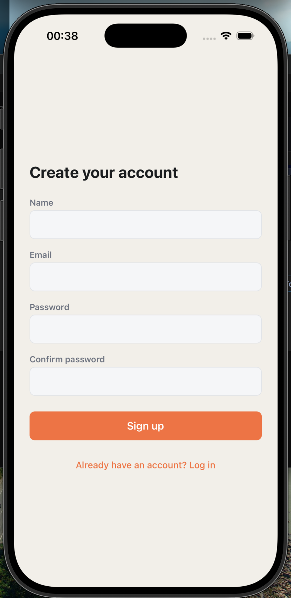

# CalendarTask

CalendarTask is a React Native (bare CLI) calendar app for iOS. Users sign up and sign in with
email and password, and can optionally unlock with Face ID or Touch ID. The calendar has a month
grid, with a list of the selected day's events below it, and an hour-by-hour day schedule.
Events can be created, edited and deleted, each with a title, notes, a start and end time, and
one of five categories (work, personal, health, social, other). A profile tab shows the
account, a biometric sign-in toggle, simple event statistics and sign-out. The live backend is
Firebase Authentication and Cloud Firestore; a local, on-device implementation sits behind the
same interfaces, and one constant switches between them.

## Screenshots

| | |
| --- | --- |
| <br>Month view: category dots under days with events, and the selected day's list, where an event from the night before is marked "Continued from Friday". | <br>Day view: the hour-by-hour schedule, with the continuing event clamped to the top of the day and labelled with its real start. |
| <br>New event: title, notes, one of five categories, and start and end pickers. | <br>Edit event: the same form pre-filled, with a delete action. |
| <br>Profile: account details, the Face ID sign-in toggle, and event statistics. | <br>Unlock: shown at launch when a biometric credential is stored; Face ID is started by a tap, never automatically. |
| <br>Log in with email and password. | <br>Sign up: name, email, password and confirmation. |

## Versions

Built and verified against:

- React Native 0.84.0
- Node v22.23.1
- Xcode 26.5
- CocoaPods 1.17.0
- iOS 26.5 simulator
- macOS 26.6.2

## Setup

```
git clone https://github.com/ArtSurdulli/CalendarTask.git
cd CalendarTask
npm install
cd ios && pod install && cd ..
```

### Choose a backend

**Recommended for reviewers: run locally.** Open `src/config.ts` and set:

```ts
export const USE_FIREBASE = false;
```

Accounts and events are then stored in AsyncStorage on the simulator. There is no external
setup, and nothing you create lands in anyone else's Firebase project. Leave
`ios/GoogleService-Info.plist` in place: the app still calls `FirebaseApp.configure()` at launch,
and that call needs the file.

**The Firebase path.** The repository ships with `USE_FIREBASE = true` and a committed
`ios/GoogleService-Info.plist` for the author's Firebase project: the configuration the app was
built and run against with Firebase Authentication and Cloud Firestore as its backend. Left as
is, sign-ups and events go to that project. To run the Firebase path against your own project
instead:

1. In the Firebase console, add an iOS app with the bundle ID
   `org.reactjs.native.example.CalendarTask`.
2. Download its `GoogleService-Info.plist` and replace `ios/GoogleService-Info.plist`.
3. Under Authentication, enable the Email/Password sign-in provider.
4. Create a Cloud Firestore database and publish the rules in [Data layer](#data-layer).

### Run

Start Metro in one terminal:

```
npm start
```

Then build and run from a second terminal:

```
npm run ios
```

To pick a simulator: `npm run ios -- --simulator="iPhone 17 Pro"`. The first build downloads
the Firebase iOS SDK through Swift Package Manager, so it needs a network connection even in
local mode.

There is no seeded account. Create one from the sign-up screen on first launch.

If the build fails at a `CodeSign` step with "resource fork, Finder information, or similar
detritus not allowed", the build output is inside an iCloud-synced folder such as `~/Desktop`,
whose files carry extended attributes that `codesign` rejects. `npm run ios` builds into Xcode's
default DerivedData under `~/Library`, which avoids this. Passing `--buildFolder` (or
`-derivedDataPath` to `xcodebuild`) with a path inside a synced project brings it back.

## Architecture

The code is organised by feature rather than by file type:

```
src/
  config.ts     USE_FIREBASE: which backend is live
  app/          Redux store, typed hooks, repositories.ts (backend selection), useReduceMotion
  components/   shared UI (FormField)
  features/
    auth/       AuthRepository + local and Firebase implementations, biometricRepository,
                authSlice, Login/SignUp/Unlock screens
    calendar/   dateUtils, MonthGrid, DayView, DayScheduleView, CalendarScreen
    events/     EventRepository + local and Firebase implementations, eventsSlice,
                eventDefaults, EventFormScreen
    profile/    ProfileScreen
  navigation/   root, auth, tab and calendar navigators; stack animation options
  theme/        colours, spacing, radius, category colours, shadows, motion
  types/        User, CalendarEvent, EventCategory
```

**Repository pattern.** Persistence sits behind two interfaces, `AuthRepository` and
`EventRepository`. Screens and Redux slices depend only on those interfaces, never on AsyncStorage
or Firebase directly. `src/app/repositories.ts` is the only module that knows which
implementation is live. `biometricRepository.ts` applies the same rule to
`react-native-keychain`: it is the only file that imports it.

**State.** Redux Toolkit, with one slice per feature (`authSlice`, `eventsSlice`). Async work
goes through `createAsyncThunk` thunks that call the repositories. Derived data, such as events
for a day, per-day event counts and categories for a month, and the profile statistics, comes
from memoised `createSelector` selectors.

**Presentational components.** `MonthGrid`, `DayView` and `DayScheduleView` have no store
access; none of them imports `react-redux` or the app's store hooks. They render what they are
given as props and report taps through callbacks. `CalendarScreen` is the connected component
that reads the store and passes data down.

## Data layer

Firebase Authentication and Cloud Firestore are the live backend, through
`@react-native-firebase` 26.4.0:

- `firebaseAuthRepository.ts` implements `AuthRepository`. The session token is the Firebase ID
  token. Firebase error codes are mapped to plain-English messages, the same ones the local
  implementation uses where the two overlap (an email already in use, a wrong email or
  password), so those errors read identically on either backend.
- `firebaseEventRepository.ts` implements `EventRepository`. Events are documents in a top-level
  `events` collection, with the owner's uid in a `userId` field. Every query filters on the
  signed-in user's uid, and create, update and delete first check that the event belongs to
  that uid. `startsAt` and `endsAt` are stored as the same local wall-clock ISO strings the rest
  of the app uses, not as Firestore Timestamps.

The local implementations, `authRepository.ts` and `eventRepository.ts`, store everything in
AsyncStorage and are unchanged. `USE_FIREBASE` in `src/config.ts` selects between the two sets.

Adding Firebase changed two existing lines of application code: one import in each slice,
which now takes its repository from `src/app/repositories.ts` instead of the local
implementation file. Everything else was new files, plus the `FirebaseApp.configure()` call
that react-native-firebase requires in `AppDelegate.swift`.

The Firebase iOS SDK is resolved through Swift Package Manager with dynamic frameworks
(`use_frameworks! :linkage => :dynamic` in the Podfile). Under SPM, Firestore's gRPC, BoringSSL
and Abseil dependencies arrive as prebuilt binaries. An earlier CocoaPods-based attempt compiled
gRPC from source and failed to generate a module map under Xcode 26.

**Firestore security rules.** These scope every event document to its owner's uid. They are not
stored in this repository, so publish them in the Firebase console:

```
rules_version = '2';
service cloud.firestore {
  match /databases/{database}/documents {
    match /events/{eventId} {
      allow read, update, delete: if request.auth != null
        && resource.data.userId == request.auth.uid;
      allow create: if request.auth != null
        && request.resource.data.userId == request.auth.uid;
    }
  }
}
```

The read rule also means a query that isn't filtered by `userId` is rejected outright rather
than returning only the caller's documents, which is why the repository always filters by uid.

## Calendar implementation

The calendar is built from scratch, with no third-party calendar library. Date logic lives in
`src/features/calendar/dateUtils.ts` as pure functions with no React or Redux dependencies,
covered by their own tests.

**Variable row count.** Weeks start on Monday. `getMonthGrid` runs from the Monday of the week
containing the 1st to the Sunday of the week containing the last day, so a month has exactly the
4, 5 or 6 rows it needs rather than a forced six. For example, February 2027 is 4 rows and
October 2023 is 6. `MonthGrid` renders only those rows, but reserves the height of six
(`MAX_CALENDAR_ROWS`) so that moving between months doesn't shift the layout below it. Each week
is its own row of seven flexible cells, so the columns always divide the available width
exactly.

**Month and day views.** A Month/Day switch sits under the header. Month view shows the grid,
with category dots on days that have events, and the selected day's event list underneath. Day
view is an hour-by-hour schedule from 12 AM to 11 PM with half-hour dividers. Tapping an empty
hour starts a new event at that hour. The header arrows move by month or by day depending on
the view.

**Overlapping events.** In the day schedule, events that overlap in time are laid out side by
side in evenly split columns. The split is capped at four columns. Past that, the remaining
concurrent events collapse into the fourth column as a single block showing the first event and
a "+N" count. Tapping that block switches to Month view, where the day's full event list is
shown.

**Events spanning midnight.** An event belongs to every day its time range overlaps, so a
20:00–01:00 event appears on both days, in the grid dots, the day list and the schedule. An
event ending at exactly midnight belongs only to the day it started. On a later day, the day
list marks it "Continued from Wednesday" and shows its real, dated start time. The schedule
clamps it to the top of the day, with a squared top edge and a "From …" label.

**Local wall-clock times.** `CalendarEvent.startsAt` and `endsAt` are ISO 8601 strings without a
UTC offset or `Z` suffix, e.g. `2026-09-23T14:00:00`. `date-fns`'s `parseISO` reads them back as
local time, so an event stays on the calendar day it was created on. `toLocalISOString` in
`dateUtils.ts` is the single sanctioned way to produce these strings from a `Date`.
`Date#toISOString` is not used anywhere in `src/`, because it converts to UTC and can move an
event onto the wrong day near midnight.

## Biometrics

Enabling Face ID or Touch ID stores the user's credentials in the iOS Keychain
(`biometricRepository.ts`), with `accessControl: BIOMETRY_CURRENT_SET` and
`accessible: WHEN_UNLOCKED_THIS_DEVICE_ONLY`. The access control is attached to the Keychain item
itself, so iOS performs the biometric check before releasing the credential; app code does not
decide whether the check passed. `BIOMETRY_CURRENT_SET` also means the item becomes invalid if
the user enrols a new face or fingerprint. Enabling biometrics from the profile screen asks for
the password again first, so a mistyped password is caught immediately instead of being stored
and failing later.

Unlock is user-initiated. When a biometric credential exists and there is no active session, the
app opens on an unlock screen with a "Use Face ID" button rather than firing the system prompt
straight away. A system dialog appearing unprompted on cold start is disorienting, and the
password form is always one tap away through "Use password instead".

**The iOS Simulator does not enforce this.** It has no Secure Enclave, and it returns
access-controlled Keychain items without showing a Face ID prompt, even with Face ID enrolled
under Features > Face ID. On the simulator, "Use Face ID" signs in immediately. The biometric
check can only be verified on a physical device.

## Animations

Transitions are set explicitly rather than left to library defaults:

- **Stack pushes**, in the auth and calendar stacks: a horizontal slide from the right.
- **Event form**: presented as a modal that slides up from the bottom.
- **Tab switches** between Calendar and Profile: a 200 ms cross-fade.
- **Month changes** in the grid: the new month slides in from the direction of travel and fades
  in over 250 ms.
- **Month/Day switch**: a 200 ms cross-fade.

Durations come from the `motion` tokens in `src/theme/motion.ts`. Reduce Motion is respected
through `AccessibilityInfo` in `src/app/useReduceMotion.ts`. The hook reads the setting at
startup and then subscribes to changes, so turning it on while the app is running takes effect
immediately. When it is on, every transition above is instant.

iOS platform limits:

- **Pushes.** The standard `slide_from_right` push resolves to the native UIKit transition, whose
  duration (about 350 ms) cannot be changed. The stacks use `simple_push` on iOS instead, which
  is the same right-to-left slide but accepts a 250 ms duration.
- **Modals.** Screens presented with `presentation: 'modal'` always use the system sheet
  animation, which has a fixed duration.
- **Android.** `animationDuration` is ignored on Android, so its transitions use platform timing.

## Accessibility

Interactive elements carry accessibility labels, roles and states throughout. Each calendar day
is announced with its full date and event count, marked "today" where it applies, and reports
whether it is selected. Event blocks and rows read out their title and time range, including
"continued from" for events that began on an earlier day. Switches and buttons report their
disabled state, and form errors are announced as alerts. Most touch targets are at least 44 pt.

The component tests query what a screen-reader user would find, by accessibility label, role
and state (for example `getByLabelText`, `getByRole('button', { selected: true })`), rather than
by test IDs. The app code sets test IDs only where there is no accessible content to query: the
decorative category dots, and the grid container whose layout pass the tests trigger.

## Testing

```
npm test                    # run the suite
npx jest --coverage         # with coverage
```

117 tests across 11 suites, all passing. Tests run against the local implementations:
`jest.setup.js` sets `USE_FIREBASE` to false and stubs the two Firebase implementation files,
since `@react-native-firebase` cannot load under Jest. Coverage is measured across all of `src/`
(excluding test files), not only the files a test imports: 46% of statements.

| Suite | Tests | Covers |
| --- | --- | --- |
| `dateUtils.test.ts` | 37 | Grid generation, 4/5/6-row months, leap years, year rollover, month and day navigation, events spanning midnight and several days, time-range formatting, local ISO round-tripping |
| `eventsSlice.test.ts` | 17 | Create/update/delete, day and month selectors including multi-day events, profile statistics, error handling |
| `MonthGrid.test.tsx` | 13 | Cell count per month, today and selected markers, category dots, day selection, column layout |
| `authSlice.test.ts` | 12 | Biometric sign-in, enrolment (a wrong password never reaches the Keychain; a cancelled prompt is not an error), enrolment offer |
| `DayScheduleView.test.tsx` | 9 | All 24 hour rows, creating at an hour, the four-column cap, events clamped across midnight |
| `DayView.test.tsx` | 9 | Sorting, empty state and create action, event selection, continuing events |
| `useViewModeCrossFade.test.tsx` | 5 | Month/Day cross-fade: no flash, reversal mid-fade, no remounting, Reduce Motion |
| `eventDefaults.test.ts` | 5 | Default start and end times for a new event, including midnight |
| `FormField.test.tsx` | 5 | Label, error alert, value and prop pass-through |
| `eventRepository.test.ts` | 4 | Local persistence, including backfilling events saved before categories existed |
| `App.test.tsx` | 1 | The full app tree renders |

Well covered (over 80% of statements): the date utilities, the events slice and local
repository, the event defaults, the presentational calendar components, the Month/Day
cross-fade, `FormField`, and the theme.

Not covered:

- The screens: Login, SignUp, Unlock, Calendar, EventForm and Profile, all under 12%.
- The Firebase repositories (0%), which are stubbed out in tests.
- The AsyncStorage auth repository and the Keychain biometric repository, both under 10%.
- The navigators, `useReduceMotion`, and the stack animation options.
- About half of the auth slice.

## Known limitations

- iOS only. The app has been built and run only on the iOS simulator; Android is untested.
- The Firestore rules are minimal. They restrict each document to its owner but do not validate
  field types or values, and they are kept in the Firebase console rather than in this
  repository.
- No offline conflict handling. Firestore's defaults apply: writes made offline are queued and
  the last write to reach the server wins.
- The Keychain item for biometric unlock holds the account password. A production app would
  store a refresh token there instead, and biometric unlock would exchange it for a new session.
- Events store local wall-clock time rather than a UTC instant plus an IANA timezone id, so an
  event has no record of the timezone it was created in.

## What I'd add next

- An agenda view listing upcoming events grouped by day.
- An app-lock layer that re-authenticates when the app returns to the foreground after a
  timeout, as banking apps do, rather than only at launch.
- Android support and verification.
